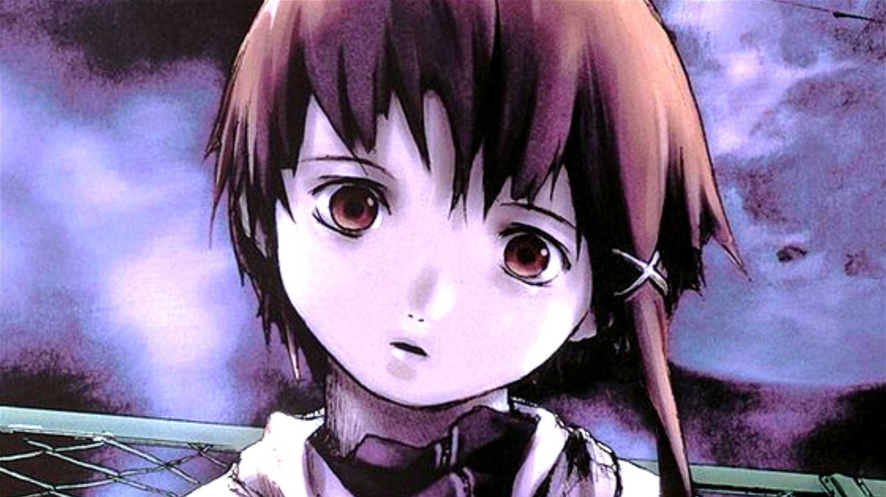

# Clearpixel
*Downscale, Enhance, Sharpen*

Clearpixel is a script that combines waifu2x with imagemagick to help with upscaling / denoising low quality high resolution pictures.

## Dependencies
- waifu2x-ncnn-vulkan
- imagemagick
- mediainfo
- bc
- awk
- sed

## Usage
```
Usage: clearpixel [options] -i INPUT_FILE -o OUTPUT_FILE

Options:
  -i input-file         Path to the image file that needs processing
  -o output-file        Output image path
  -d downscale-rate     Downscale the picture before upscaling by a percentage.
                        Can help with pictures that are low in quality proportional
                        to the resolution. (0% - 100%, default = 100%)
                        Ex. 95% would downscale the picture to 95% of the original resolution
  -u upscale-rate       Upscale ratio. (1 - 32, default = 2)
  -n denoise-rate       Denoising rate. (-1 - 3, default = 1)
  -s sharpen-sigma      Sharpening sigma. High values can take ages to process (0 - infinity, default = 2)
  -e                    Use imagemagick -enhance command to denoise the image after upscaling. Can reduce
                        image clarity
  -p                    Output a preview picture instead of the final result.
                        The preview version will be half original and half upscaled
  -h | --help           Prints out this text block you are reading right now
```

## How is this different from Waifu2x etc.?
Clearpixel itself doesn't do anything special. It merely combines imagemagick and waifu2x.

I often found myself downscaling pictures before upscaling them, because that somehow resulted in better results with low quality high resolution pictures. After doing that enough times, it just made sense to automate the whole process to save myself some time. As a cherry on top, clearpixel also does sharpening and has an option to create a preview picture that you can use to see if the quality even improved at all.

## Demonstration
### Original


### Waifu2x only
```
waifu2x-ncnn-vulkan -s 4 -n 3 -i ./lain.jpg -o ./lain_waifu2x.jpg
convert -size 25% ./lain_waifu2x.jpg ./lain_waifu2x.jpg
```


### Clearpixel
Downscale to 25% of the original resolution and upscale after that + sharpening on top
```
clearpixel -u 4 -n 3 -d 25% -s 3 -i ./lain.jpg -o ./lain_clearpixel.jpg
```


### Clearpixel preview mode
```
clearpixel -p -u 4 -n 3 -d 25% -s 3 -i ./lain.jpg -o ./lain_clearpixel_preview.jpg
```

